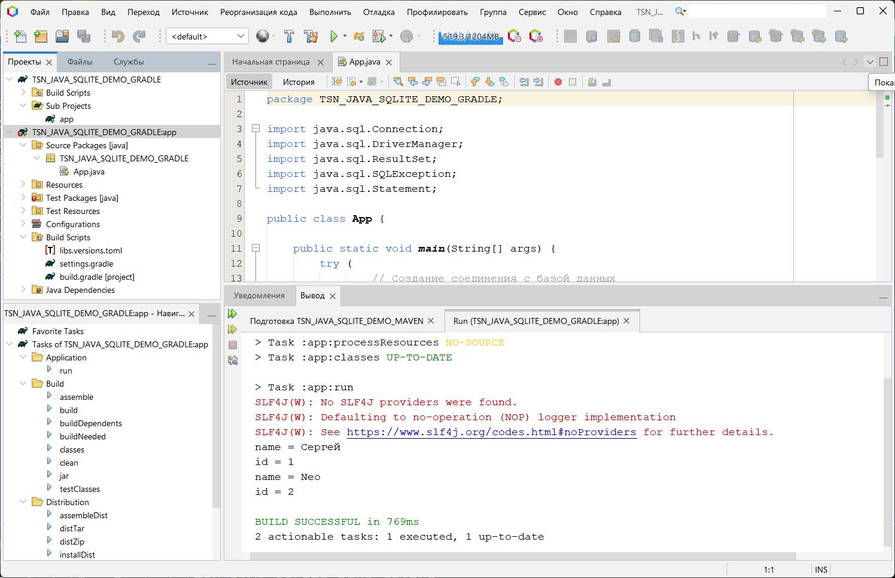

# TSN_JAVA_SQLITE_DEMO
Простейший пример работы с базой данных SQLite через JDBC в NetBeans с Gradle

**build.gradle:**
```
plugins {
    // Apply the application plugin to add support for building a CLI application in Java.
    id 'application'
}

repositories {
    // Use Maven Central for resolving dependencies.
    mavenCentral()
}

dependencies {
    // Use JUnit Jupiter for testing.
    testImplementation libs.junit.jupiter

    testRuntimeOnly 'org.junit.platform:junit-platform-launcher'

    // This dependency is used by the application.
    implementation libs.guava

    // https://mvnrepository.com/artifact/org.xerial/sqlite-jdbc
    implementation 'org.xerial:sqlite-jdbc:3.45.2.0'

    // https://mvnrepository.com/artifact/org.slf4j/slf4j-api
    implementation 'org.slf4j:slf4j-api:2.0.13'

}

// Apply a specific Java toolchain to ease working on different environments.
java {
    toolchain {
        languageVersion = JavaLanguageVersion.of(17)
    }
}

application {
    // Define the main class for the application.
    mainClass = 'TSN_JAVA_SQLITE_DEMO_GRADLE.App'
}

tasks.named('test') {
    // Use JUnit Platform for unit tests.
    useJUnitPlatform()
}

```


